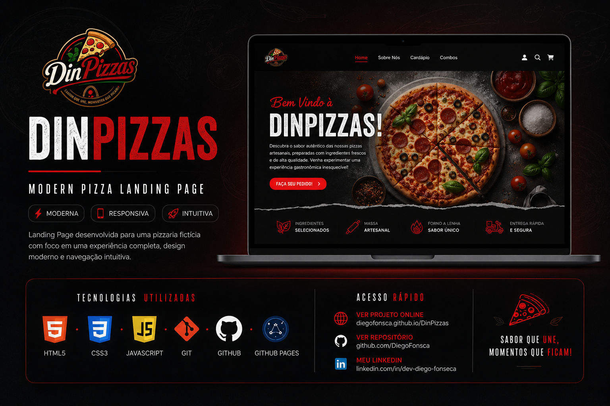

# 🍕 DinPizzas

## 🌐 Projeto Online

👉 **https://diegofonsca.github.io/DinPizzas/**

---

## 📖 Sobre o projeto

O **DinPizzas** é uma Landing Page desenvolvida para uma pizzaria fictícia com foco em uma interface moderna, responsiva e intuitiva.

Este projeto foi criado com o objetivo de praticar conceitos fundamentais de desenvolvimento Front-End, aplicando boas práticas de HTML, CSS, JavaScript e versionamento com Git.

---

## 🚀 Tecnologias Utilizadas

- HTML5
- CSS3
- JavaScript
- Flexbox
- CSS Grid
- Git
- GitHub
- GitHub Pages
- Ionicons

---

## ✨ Funcionalidades

- ✅ Layout moderno
- ✅ Totalmente responsivo
- ✅ Menu de navegação
- ✅ Animações Fade In nas seções
- ✅ Navegação suave
- ✅ Organização semântica do HTML

---

## 🎯 Objetivo

Este projeto foi desenvolvido para consolidar conhecimentos em desenvolvimento Front-End, praticando:

- HTML semântico
- CSS moderno
- Flexbox
- Grid Layout
- Responsividade
- Manipulação do DOM
- JavaScript
- Versionamento com Git
- Publicação com GitHub Pages

---

## 📱 Responsividade

O projeto foi desenvolvido para proporcionar uma boa experiência em diferentes dispositivos.

- 💻 Desktop
- 📱 Smartphones
- 📲 Tablets

---

### 🌎 Projeto Online

https://diegofonsca.github.io/DinPizzas/

### 💼 LinkedIn

https://www.linkedin.com/in/dev-diego-fonseca

### 💻 GitHub

https://github.com/DiegoFonsca

---

## 👨‍💻 Autor

**Diego Fonseca**

Graduado em Gestão da Tecnologia da Informação.

Pós-graduando em Arquitetura de Software pela PUC PR.

Apaixonado por desenvolvimento Back-End, buscando construir soluções modernas e escaláveis.

---

Obrigado pela visita!
